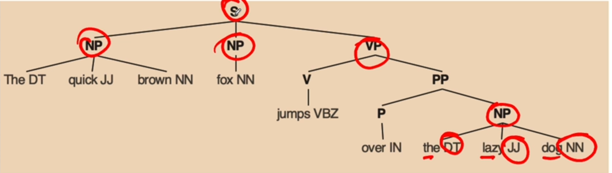

# Natural-Language-Processing

## What is NLP ?
* An area of Airtificial Intellligence which takes raw, written (in natual human language), and transforms it into a form that computer can understand.

##  NLP task in general
1. language modeling
    * Task of predicting the what the next world in a sentence, based on the sequence of words appering in a given langauge.
    example: Used in Speech recognition, OCR, Translation, Speeling corection etc..
2. Test classification
    * Task of assinging the text into a known set of categories based on content
    * Used in Email Spam Identification, Sentiment Analysis etc..
3. Information extraction
    * Extracting the relevant information from text
    * Extract user's intent from the input text, calender eventsfrom emails, names mensioned in email, etc.
4. Conversion Agent
    * Building Dialogue systems that can converse in human language 
    * Siri, google Assistant, Alexa are the applications
5. Text summarization
    * Create short summary of a large document by retaining the important information
    * Summary report Generation from Social media information
6. Question answering
    * Building the system to do or ability to answer the question whuch are posed in natural langauge in an automatic manner
    * Example Chatbot
7. Machine Translation
    * Ability to convert a text from one langauge to another langauge
8. Topic Modeling
    * Uncovering important topics from large collection of text
    * Used in Text Mining
9. Information Retrieval
    * Finding the documents / data based on user's query
    * Useed in search Engines
    
## What are Linguistics ?
* The scientific study of language and it's structure including the study of grammar, syntax and phonetics 

# Understanding Human Langauge
## Building blocks of language
1. Phonemes - speech and sounds
    * A phoneme is the smallest unit of sound in speech / language
    * Do not have any meaning themselves, but can induce one when uttered in combination of other phonemes
    * English lanaguage has 44 Phonemes
    * Time-frequency analysis reveals that there are totally 37 distinct phonemes in Kannada language
    * The 44 English phonemes are represented by the 26 letters of the alphabet individually and in combination. Phonics instruction involves teaching the relationship between sounds and the letters used to represent them
    * Consideration in building the application: 
        * Speech Understanding, Speech to text transcription and text to speech conversion.

2. Morphemes and Lexemes - words
    A) Morphemes : -
        * A Morphemes is the smallest unit of a word that provides a specific meaning to a string of letters  (Phonemes)
        * Not all Morphemes are words, but all prefixes and suffixes are Morphemes,
        * Exanple: In the word - multistorey, 
        "multi-" is not a word but a prefix that changes the meaning when put togethger with storey. "Multi" is a Morphemes.   
    B) Lexemes : -
        * A lexeme represents the most basic building block of a language.
        * If you open a typical dictionary, the entries there are lexemes,
        * Most Lexemes have variations which build upon its most basics form.
        Example: walks, walked, walking
        * When a building the NLP based applications Morphemes and Lexemes are used in techniques like 
            -Tokenization -Stemming -Lemmantization -Word embeddings
            -Part of speech tagging

3. Syntax - phrases and sentences
    * The set of rules that determines the arrangement of the words in a sentences.
    * Representation of sentence is done with parse tree.
    * Entity Extraction and Relation Extraction
    Parse Tree:
        - it represents the Hierarchical structure of language 
        - way of a represnts the syntax of the language
        - Words at lowest level
        - Followed by POS tags
        - Followed by phrases
        - Sentence at the hishest level
        - representation of Parse Tree is the lanagauge spefic
        

4. Context - meaning
    * Context refers to the words and sentences that surround any part of a discourse and that helps to determine its meaning.
    * Context includes long term references, world knowledge and comnon sense
    * Context is Made Up of:
        1. Semantics : Direct meaning of words
        2. Pragmatics : Adds the World Knowledge and external Knowledge
        3. NLP Applications using Context:
            Sarcasm Detection, Summarixation and topic modeling

# Challenges of NLP
1. Ambiguity (ಅಸ್ಪಷ್ಟತೆ) : It is the presence of two or more possible meanings in a single passage.
    Example: We saw her duck.
    It can mean - We saw lower her head or We saw the duck belonging to her.
# common Knowledge Assumption
    1. Refers to set of all facts are known 
    2. Assumed that these facts are already known
    3. Difficult for computers to process the same
        Example
            Sun Rises in East
            Sun Rises in west
    4. Humans are creative beings
    5. Various Dialects, styles, variation are used in any language
    6. Difficult for machines to understand the creativity of humans